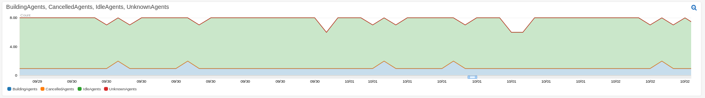
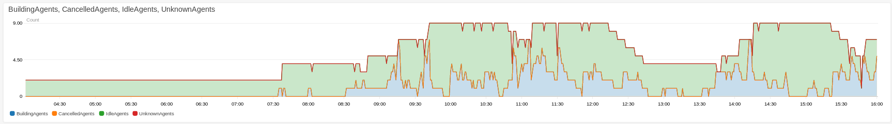

# docker-gocd-scaler
Utility container for enabling autoscaling a GoCD stack in AWS EC2.

## Before

## After


## What does it do?
### GoCD Server
When run on the server, the container will ship metrics about how many instances are building, idle, etc. The number of idle instances is the metric used for scaling the agent ASG.
### GoCD Agent
When run on the agent, the container will periodically poll the server to determine whether or not it is building. If it is, the container will enable termination protection on the instance to avoid terminating it in the middle of a build because of a scale-in event.

## How to Use
### GoCD Server
  * Set `GOCD_USERNAME` and `GOCD_PASSWORD` with credentials for a user that has access to the API
  * Make sure your instance has permission to create/put metrics in CloudWatch
  * Run the container. It accesses `localhost:8153` so you'll need host networking if you're just running the container on the master directly. Add this to your UserData:
```
docker run --network=host --userns=host --restart=always -d -e "GOCD_USERNAME=${GoCDUsername}" -e "GOCD_PASSWORD=${GoCDPassword}" aarongorka/gocd-scaler:2.0.0 master
```

### GoCD Agents
  * Set `GOCD_USERNAME`, `GOCD_PASSWORD` and `GOCD_URL` with credentials for a user that has access to the API
  * Make sure your instance has permission to set termination protection on itself (`autoscaling:SetInstanceProtection`)
  * Add the following to your UserData:
```
# nohup and & to prevent blocking on the download of the image
nohup docker run --network=host --userns=host --restart=always -d -e "GOCD_USERNAME=${GoCDUsername}" -e "GOCD_PASSWORD=${GoCDPassword}" -e "GOCD_URL=${GoCDUrl}" aarongorka/gocd-scaler:2.0.0 agent &
```

## Scaling Policies
Once your GoCD server is reporting metrics and your GoCD agents are protecting themselves during builds, you can enable scaling.
```yaml
    ScaleUpAlarm:
      Type: AWS::CloudWatch::Alarm
      Properties:
        AlarmDescription: 'GoCD is out of free agents'
        Namespace: GoCD
        MetricName: IdleAgents
        ComparisonOperator: LessThanOrEqualToThreshold
        Statistic: Minimum
        Period: !Ref GoCDAgentScalingPeriod
        EvaluationPeriods: 1
        Threshold: !Ref GoCDAgentScalingThreshold
        AlarmActions:
        - !Ref ScaleUpPolicy

    ScaleUpPolicy:
      Type: "AWS::AutoScaling::ScalingPolicy"
      Properties:
        AdjustmentType: ChangeInCapacity
        AutoScalingGroupName: !Ref AutoscalingGroupAgents
        Cooldown: '300'
        ScalingAdjustment: '2'

    ScaleDownAlarm:
      Type: AWS::CloudWatch::Alarm
      Properties:
        AlarmDescription: 'GoCD has too many idle agents'
        Namespace: GoCD
        MetricName: IdleAgents
        ComparisonOperator: GreaterThanOrEqualToThreshold
        Statistic: Minimum
        Period: !Ref GoCDAgentScalingPeriod
        EvaluationPeriods: 60
        Threshold: !Ref GoCDAgentScaleDownThreshold
        AlarmActions:
        - !Ref ScaleDownPolicy

    ScaleDownPolicy:
      Type: "AWS::AutoScaling::ScalingPolicy"
      Properties:
        AdjustmentType: ChangeInCapacity
        AutoScalingGroupName: !Ref AutoscalingGroupAgents
        Cooldown: '300'
        ScalingAdjustment: '-1'
```
